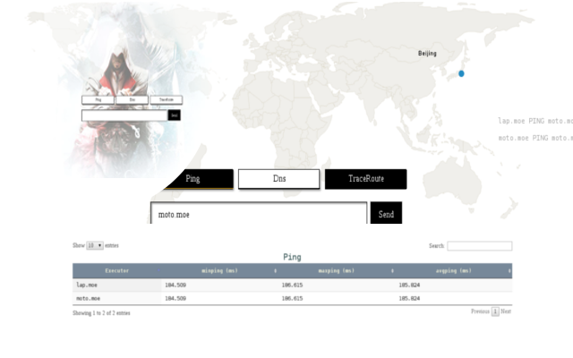

# Assassin  
Assassin is a web-based ping,dig,traceroute service.

 

## Technology stack
* [Tornado](https://www.tornadoweb.org/)
* [SaltStack](http://saltstack.com/) 
* [jQuery](https://jquery.com/)
* see [requirements.txt](./requirements.txt) [bower.json](./bower.json) for full list  

## Installation  
`pip install -r requirements.txt`  
`npm install && bower install && tsd install`  

## Development  
`python server.py --debug=true`
Just take a look at `localhost:8080/client`

## LICENSE
GNU GENERAL PUBLIC LICENSE Version 2
